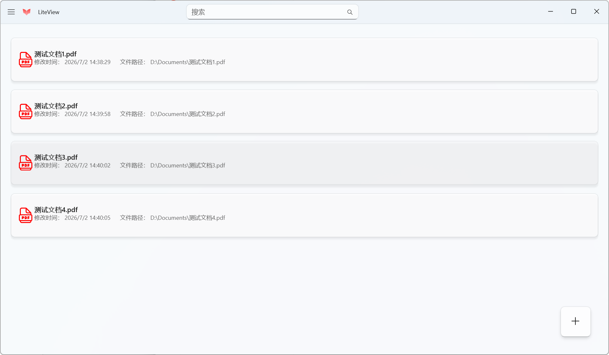
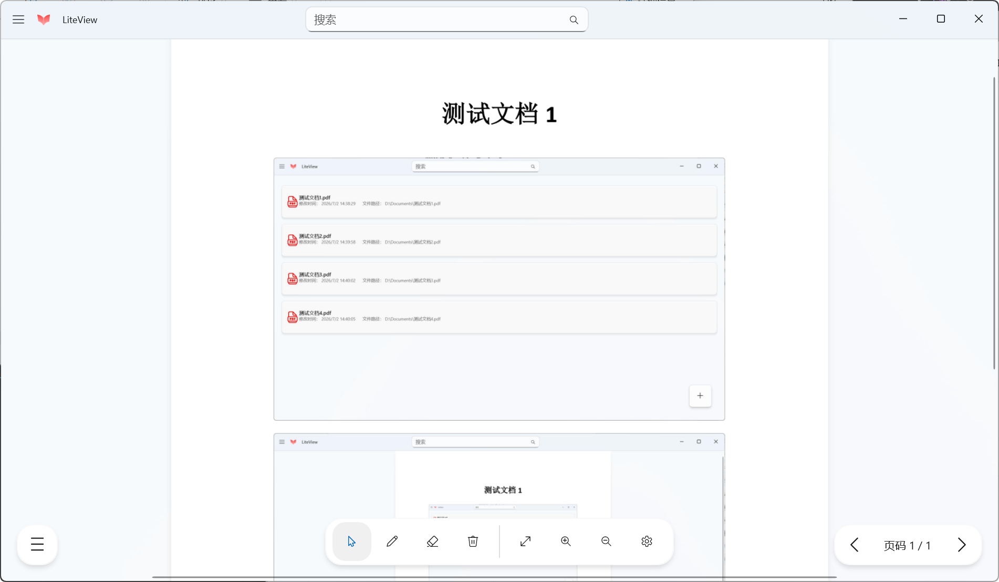

# LiteView

**Language**：[简体中文](README.md)

A lightweight native **WinUI 3** PDF reader for Windows 10/11, built with .NET 8 and PDFium.

## Features

- **PDF Library Management** — Add, browse, and search PDF files from the local file system; metadata is persisted as JSON.
- **PDF Reading** — Smooth multi-page scrolling with zoom (in/out/fit to window) and page navigation (previous/next/jump to page).
- **Annotation** — Freehand pen tool with customizable color and stroke thickness; eraser tool to remove ink strokes.
- **Theme Switching** — Supports system default, light, and dark themes.
- **Full‑Screen Mode** — Immersive reading experience.
- **Localization** — Simplified Chinese and English (English support is not fully complete).
- **Update Detection** — Automatically checks for new versions via a Supabase REST API on startup.
- **Mica Background** — Modern interface with Mica material.

 (Note: strokes are currently kept in memory only and will be lost when the page is closed.)

## Screenshots



## Requirements

- Windows 10 (version 1809 / build 17763) or later
- [Visual Studio 2022](https://visualstudio.microsoft.com/) with the following workloads:
  - .NET desktop development
  - Universal Windows Platform development
  - Windows App SDK C# templates
- [.NET 8 SDK](https://dotnet.microsoft.com/download/dotnet/8.0)
- Windows App SDK 1.8 (restored automatically via NuGet)

## Build and Run

### Visual Studio

1. Open `LiteView.slnx`
2. In the solution platform drop‑down, select your target platform (x86 / x64 / ARM64)
3. Choose the launch profile:
   - **LiteView (Package)** — run as a packaged MSIX application (default)
   - **LiteView (Unpackaged)** — run as an unpackaged desktop application
4. Press **F5** or **Ctrl+F5** to build and run

### Command Line

```powershell
# Restore dependencies
dotnet restore LiteView.slnx

# Build (packaged mode)
dotnet build LiteView.slnx -c Debug -p:Platform=x64

# Run (unpackaged mode)
dotnet run --project LiteView\LiteView.csproj -c Debug -p:Platform=x64
```

## Packaging and Publishing

Each supported platform has a corresponding publish profile:

```powershell
dotnet publish LiteView\LiteView.csproj -c Release -p:Platform=x64 /p:PublishProfile=Properties\PublishProfiles\win-x64.pubxml
```

Supported target runtimes: `win-x86`, `win-x64`, `win-arm64`

## Technology Stack

| Component | Technology |
|---|---|
| UI Framework | WinUI 3 (Windows App SDK 1.8) |
| Language/Runtime | C# (.NET 8) |
| PDF Engine | PDFium (via PdfiumViewer + P/Invoke) |
| Architecture | MVVM (CommunityToolkit.Mvvm) |
| Data Storage | JSON (System.Text.Json) |
| Rendering | XAML Shapes (Path / PolyQuadraticBezierSegment) |
| Localization | `.resw` resource files |

## Project Structure

```
LiteView/
├── Controls/          # Custom controls (PdfViewerControl, AnnotationCanvas, PdfListItem)
├── Helpers/           # Helpers (theme, window, image, shadow)
├── Models/            # Data models (PdfItem, Stroke, VersionInfo, etc.)
├── Native/            # PDFium P/Invoke bindings and rendering
├── Pages/             # Application pages (PdfListPage, PdfViewerPage, SettingsPage)
├── Services/          # Data services (PdfDataService)
├── Styles/            # Data templates and styles
├── Strings/           # Localization resources (en-US, zh-CN)
├── Assets/            # Icons and images
└── Properties/        # Publish profiles and launch settings
```

## Localization

Add `.resw` files in the `Strings/` directory to extend language support. Currently supported:
- `zh-CN` — Simplified Chinese
- `en-US` — English

## License

This project is open‑sourced under the [MIT License](LICENSE.txt).